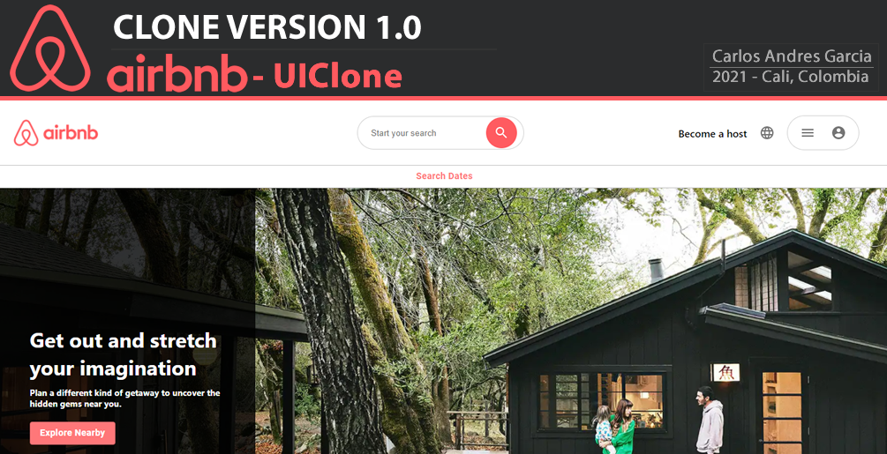

# Description
It's a Simple WhatsApp Clone using HTML, CSS, ReactJS, Redux, Node, Firebase, Google Authentication.
WhatsApp Messenger is an instant messaging application for smartphones and browsers, in which messages are sent and received through the Internet, this version has authentication implemented thanks to Firebase Authentication, which works by logging in with Gmail accounts. Among its functions are to create groups or chat rooms and to review the messages that have been sent.

This version is still very basic, so many of the functionalities are not implemented and are only aesthetic.

# Main Features

- Send and receive messages
- Mesage storage in Firebase Cloud Firestore
- Authenticate with Firebase
- Dynamic avatar for each Group
- Aesthetic similar to WhatsApp
- Supported in Google Chrome, Firefox, Microsoft Edge browsers

# Use

### !!!Note: NODEJS should be Installed, if not, download and install it [https://nodejs.org/en/](https://nodejs.org/en/)!!!

1. Clone the respository
```sh
git clone https://github.com/agzsoftsi/CloneVersion-WhatsApp.git
```

2. Enter to the code Directory
```sh
cd karlsapp
```

3. Install Dependencies
```sh
npm install
```

4. Run App
```sh
npm start
```


# Steps to Create the App:

1. Create the Folder project:
```sh
npx create-react-app karlsapp
```
wait to process is completed

2. create project on Firebase platform:
- Go to : https://console.firebase.google.com/
- Add project +
> - Project name: karlsapp --> continue
> - Google analytics Config : Default Account for firebase --> create Project

3. Project Setting on Firebase:
- Go to settings --> select de icon <> in bottom of the page.
> - Add Firebase to your web app:
> > - register app: karlsapp
> > > - also set up firebase Hosting: checked
> > > - Press Button: Register App
> > - Add firebase SDK: next
> > - Install firebase CLI: next
> > - Deploy to firebase hosting: continue to console

4. Firebase SDK snippet: config - "copy the code"
- Go to project ./karlsapp/src/
> - Create file: firebase.js
> - paste code of config inside of the firebase.js


5. Go inside of the Project folder and Run app:
```sh
cd karlsapp
npm start
```
6. Optional (Delete App.test.js - Delete log.svg)
7. Clean file app.css
8. put in first on file index.css
```sh
* {
  margin: 0;
}
```
9. Create components and Styles:
- create styles base for app.js in app.css
- create component Sidebar.js and Sidebar.css

10. install Material UI : https://material-ui.com/
```sh
npm install @material-ui/core
```

11. install Icons: https://material-ui.com/components/icons/#icons

https://material-ui.com/components/material-icons/

```sh
npm install @material-ui/icons
```

12. put icons and stylized the sidebar top and search bar

13. config avatars from : https://avatars.dicebear.com/docs/http-api

14. create chat panel sections

15. config send and receive message

15. config firebase access:
- install firebase:
```sh
npm install firebase
```
- initialize firebase inse firebase.js: copy and paste

```sh
import firebase from 'firebase';


const firebaseApp = firebase.initializeApp(firebaseConfig);
const db = firebaseApp.firestore();
const auth = firebase.auth();
const provider = new firebase.auth.GoogleAuthProvider();
export { auth, provider }
export default db;
```

- Create database on https://console.firebase.google.com/
> - Select option: Cloud firestore -> create database
> - Select Location: nam5(us-central)
> - select in security: test mode
Done

- Cloud Firestore config:
> - start collenction:
> > - Collection ID: rooms --> next
> > - field: name, type: string, value: Welcome Room
> > - press Auto ID document
Save

- link the database from firebase to sidebar.js and show the rooms on app
- program to add new chat room

16. Create router for each rooms:
- install:
```sh
npm install react-router-dom
```

17. Add Google Authentication
> - remenber enable the authentication method from console.firebase

18. Manipulate data from Google user API to the App

19. Create on firebase, the message colection for each room
> - go to start a Collection on right side of rooms and:
> > - Collection ID: messages
> > > - Document ID: automatic
> > > - field: message
> > > - type: string
> > > - value: Welcome Guys

> > > - field:name
> > > - type: string
> > > - value: karlgarmor


> > > - field:timestamp
> > > - type: timestamp

Done

20. programas send message 

21. Deploy on heroku:
```sh
npm install -g create-react-app
create-react-app my-app
cd my-app
git init
heroku create -b https://github.com/mars/create-react-app-buildpack.git
git add .
git commit -m "react-create-app on Heroku"
git push heroku master
heroku open
```


## :sagittarius: Author

> :man: Carlos Andres Garcia Morales

> :e-mail: [E-mail](agzsoftsi@gmail.com)

> :octocat: [Github](https://github.com/agzsoftsi)

> :bird: [Twiiter](https://twitter.com/karlgarmor)

> :blue_book: [Linkedin](https://twitter.com/karlgarmor)

> :globe_with_meridians: [WebPage](https://www.agzsoftsi.tech/)
